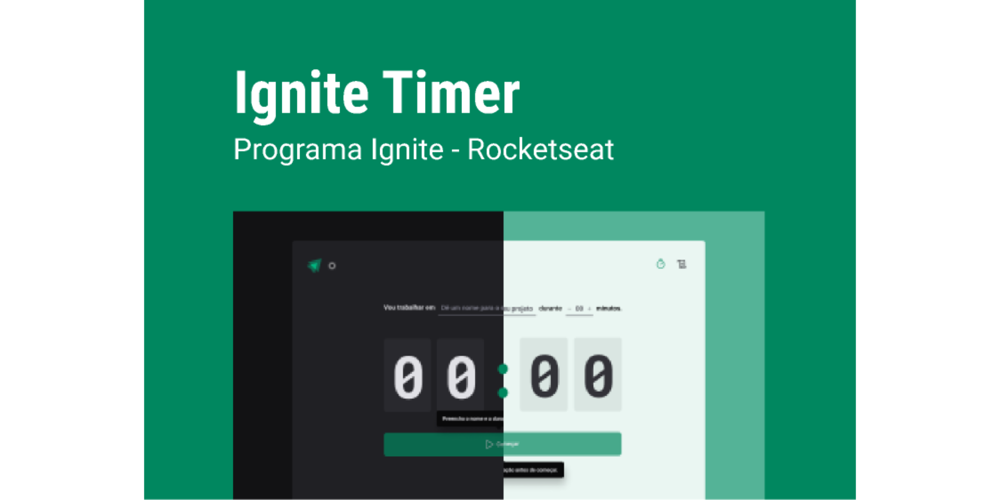

<h1 align="center">
  Ignite Call
</h1>
<p align="center" margin-top="25px" >
  
</p>


## 💻 About

Relogio pomodoro com cronogramas temporais

 
## 🛠 Tech Stack

- [React](https://reactjs.org) 
- [React-hook-form](https://react-hook-form.com/)
- [Zod](https://github.com/colinhacks/zod)
- [TypeScript](https://www.typescriptlang.org)
- [styled-components](https://styled-components.com/)
- [Phosphor-react](https://phosphoricons.com/)   
- [Vite](https://vitejs.dev/)
- [Immer](https://www.npmjs.com/package/immer) 
___

## 🔖 Layout 

Acesse o link e veja o design do projeto no figma

- [Layout Web](https://www.figma.com/community/file/1209622340482636857/Ignite-Timer-(Community))

___ 

## Web 

<p align="center" margin-top="25px" >
  
</p>

___ 

## 🚀 Como funciona

### Pre-requisitos
Ferramentas instaladas em sua máquina: [Git] (https://git-scm.com/), [Node.js] (https://nodejs.org/en/).

Node: 18

#### 🧭 Executando a aplicação (Frontend)

```bash
# Clone do repositório
$ git clone git@github.com:RobsonFeitosa/ignite-timer.git

# Acesso ao projeto pelo terminal
$ cd ignite-timer

# Instalando dependências
$ npm install 
 
# Executando aplicação em desenvolvimento
$ npm run dev 
``` 
